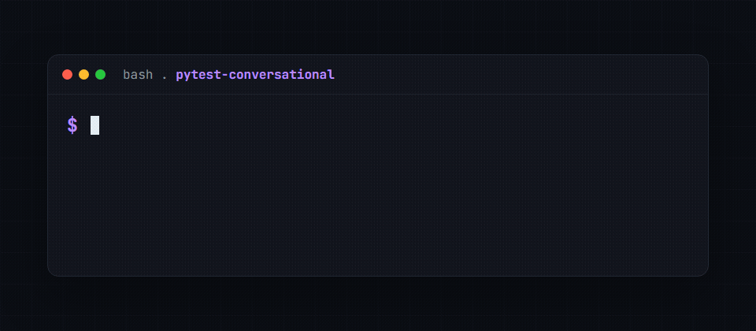

# pytest-conversational

[](https://github.com/golikovichev/pytest-conversational/actions/workflows/ci.yml)
[](https://github.com/golikovichev/pytest-conversational/actions/workflows/codeql.yml)
[](https://www.bestpractices.dev/projects/13010)
[](https://tessl.io/registry/golikovichev/pytest-conversational)
[](https://codecov.io/gh/golikovichev/pytest-conversational)
[](https://pypi.org/project/pytest-conversational/)
[](https://pepy.tech/project/pytest-conversational)
[](https://pypi.org/project/pytest-conversational/)
[](https://opensource.org/licenses/MIT)
[](https://github.com/golikovichev/pytest-conversational/commits/main)

A pytest plugin for testing chat bots, voice assistants, IVR menus. Rule-based assertions, no LLM dependency.

Status: v1.0.0, released June 2026.

## Why

Most chat-bot test setups fall into one of two camps. Either a pile of `requests.post` calls with hand-rolled assertions, or a heavy framework that pins you to one platform. This plugin sits in the middle: a small `Conversation` object, a callable bot adapter, and pytest fixtures that wire them together.

You bring the bot. The plugin keeps turn order and per-conversation state, then prints a transcript when an assertion fails.



## Install

```bash
pip install pytest-conversational
```

Python 3.10 and above.

## Quick start

```python
def my_bot(text, convo):
    if "hello" in text.lower():
        return "hi"
    return "sorry, did not get that"


def test_greeting(conversation_factory):
    convo = conversation_factory(bot=my_bot)
    convo.say("hello there")
    assert convo.last.bot == "hi"
```

## Multi-turn state

Adapters can read `convo.state` and `convo.turns` to keep slots between turns:

```python
def slot_filling_bot(text, convo):
    slots = convo.state.setdefault("slots", {})
    if "name" not in slots:
        slots["name"] = text
        return "got it, what city?"
    if "city" not in slots:
        slots["city"] = text
        return f"hello {slots['name']} from {slots['city']}"
    return "done"


def test_two_slot_flow(conversation_factory):
    convo = conversation_factory(bot=slot_filling_bot)
    convo.say("Mikhail")
    convo.say("Hove")
    assert convo.state["slots"] == {"name": "Mikhail", "city": "Hove"}
    assert convo.last.bot == "hello Mikhail from Hove"
```

## Data-driven scenarios

Repetitive dialogues - the same shape with different inputs (greetings per language, slot variants, fallback phrasings) - load from a YAML or JSON file and run as one test per case. Mark the test with `data=` and take a `scenario` argument:

```python
import pytest
from pytest_conversational import expect

@pytest.mark.conversational(data="tests/data/order_status.yaml")
def test_order_status(scenario, scenario_fixtures, conversation_factory):
    convo = conversation_factory(bot=scenario_fixtures["bot"])
    for turn in scenario.turns:
        convo.say(turn.user)
        if turn.expect_contains:
            expect.contains(convo.last.bot, turn.expect_contains)
```

```yaml
# tests/data/order_status.yaml
- name: english_path
  fixtures: { bot: english_bot }     # a fixture per case (e.g. a locale bot)
  turns:
    - user: "where is my order?"
      expect_contains: "order number"
- name: russian_path
  fixtures: { bot: russian_bot }
  turns:
    - user: "gde moy zakaz?"
      expect_contains: "nomer zakaza"
```

Each case becomes its own test, with the scenario `name` as the pytest id (visible in `pytest --collect-only`). The file is data, not behaviour: the test keeps control of the assertions, and a case's `fixtures` overrides resolve to live fixtures through `scenario_fixtures`. A malformed file (missing `name`/`turns`, a non-mapping `fixtures`) fails collection with a clear message rather than a stack trace.

JSON works out of the box; YAML needs the optional extra:

```bash
pip install pytest-conversational[scenarios]
```

The decorator form `@parametrize_scenarios("cases.yaml")` is also available for tests that prefer a parametrize-style API over the marker.

## HTTP webhook adapter

If your bot lives behind an HTTP endpoint, use the bundled adapter instead of writing one by hand:

```bash
pip install pytest-conversational[http]
```

```python
from pytest_conversational import Conversation
from pytest_conversational.adapters import http_webhook


def test_remote_bot():
    bot = http_webhook("https://my-bot.example.com/webhook", timeout=3.0)
    convo = Conversation(bot=bot)
    convo.say("hello")
    assert "hi" in convo.last.bot.lower()
```

The default contract: POST `{"user": text, "history": [[u, b], ...]}`, expect `200 OK` with JSON `{"reply": "..."}`. If your endpoint speaks a different shape, pass `request_builder` and `response_parser` callbacks.

### Security note

The webhook URL is passed through to `httpx` as-is. If your test feeds a URL it pulled from user input, fixture data, or another untrusted source, the adapter will happily hit it. That includes internal addresses like `127.0.0.1`, `169.254.169.254` (cloud metadata service), or `10.x.x.x` inside a VPC. Pin the URL to a hard-coded value in the test, or gate it through your own allowlist before passing it in.

## Async bots

If your bot is a coroutine (a FastAPI handler, an aiogram dispatcher, a
LangChain `ainvoke` wrapper), drive it with `say_async` instead of `say`:

```python
import asyncio
from pytest_conversational import Conversation


async def my_async_bot(text, convo):
    reply = await call_my_model(text)
    return reply


def test_async_bot():
    convo = Conversation(bot=my_async_bot)
    asyncio.run(convo.say_async("hello"))
    assert convo.last.bot
```

`say_async` keeps the same turn order, `history`, and partial-transcript-on-failure
behaviour as `say`. Passing an `async def` bot to the synchronous `say()` raises a
`TypeError` that points you here, rather than silently storing an un-awaited
coroutine as the reply.

## Matchers

`expect` is a small module of assertion helpers tuned for bot replies. Each matcher raises `AssertionError` with the actual reply embedded in the message, so pytest output shows what the bot said versus what the test wanted.

```python
from pytest_conversational import expect

def test_replies(conversation_factory):
    convo = conversation_factory(bot=my_bot)
    convo.say("hi")

    expect.contains(convo.last.bot, "hello")
    expect.not_contains(convo.last.bot, "error")
    expect.regex(convo.last.bot, r"^hello\s+\w+")
    expect.one_of(convo.last.bot, ["hello there", "hi there", "hey"])
```

- `contains(actual, substring, *, case_sensitive=False)`: substring search. Case-insensitive by default.
- `not_contains(actual, substring, *, case_sensitive=False)`: the negative of `contains`. Guards against leaks, for example a bot echoing an internal error, a stack trace, or a value it was never given.
- `regex(actual, pattern, *, flags=0)`: `re.search` semantics. Returns the match object so callers can inspect captured groups.
- `one_of(actual, options, *, case_sensitive=False, mode="exact")`: matches `actual` against a list of alternative `options`. Supports `mode="exact"` (full-string match, default) and `mode="substring"` (checks if any option is a substring of `actual`).

The next four matchers inspect metadata your adapter records rather than the reply text. They check what the adapter wrote; they do not classify, extract, or time anything themselves.

- `has_intent(turn, intent_name)`: asserts `turn.metadata["intent"]` equals `intent_name`.
- `has_slot(turn, slot_name, value=...)`: asserts `slot_name` is present in `turn.metadata["slots"]`. Pass `value=` to also assert the stored value.
- `has_state(convo, state_name, value=...)`: asserts `state_name` is present in `convo.state`, the conversation-wide dict that persists across turns. Pass `value=` for equality.
- `responds_within(turn, seconds)`: asserts `turn.metadata["latency_ms"]` is within the `seconds` budget (converted to milliseconds).

Use these when bare `assert "hello" in convo.last.bot` would give noisy failure messages across many tests. For one-off checks, plain `assert` is still fine.

## Fixtures

| Fixture | Purpose |
| --- | --- |
| `conversation` | Empty Conversation, no adapter. Good for user-only flows. |
| `conversation_factory` | Builder. Pass a bot callable, get a fresh Conversation. |

## Public API

- `Conversation(bot=None, turns=[], state={})`
- `Conversation.say(text)`: drive a turn through the adapter, return the Turn.
- `Conversation.say_async(text)`: await a coroutine adapter, return the Turn.
- `Conversation.add_user(text)`: append a user-only turn.
- `Conversation.last`, `.turns`, `.history`, `.transcript()`.
- `Turn(user, bot, metadata)`.
- `BotAdapter = Callable[[str, Conversation], str]`.
- `expect.contains`, `expect.not_contains`, `expect.regex`, `expect.one_of`.

## Roadmap

- v0.4: scenario DSL loaded from YAML or plain text fixtures. Shipped.
- v0.5: async adapter support for coroutine-based bots (`say_async`). Shipped.
- v1.0: 12.06.2026 release. Shipped.

## Contributing

Contributions welcome. See [CONTRIBUTING.md](CONTRIBUTING.md) for setup and the PR workflow. A couple of `good first issue` slots are open in the [issue tracker](https://github.com/golikovichev/pytest-conversational/issues) if you want to jump in.

## Licence

MIT. See `LICENSE`.
